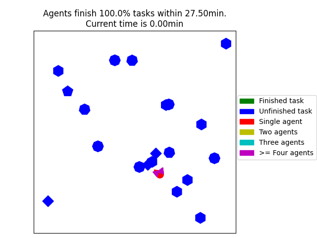

# DCMRTA
Code for ICRA2024 Paper: Dynamic Coalition Formation and Routing for Multirobot Task Allocation via Reinforcement Learning.

This is a repository using deep reinforcement learning to address single-task agent (ST) multi-robot task(MR) task assignment problem.
We train agents make decisions sequentially, and then they are able to choose task in a decentralized manner in execution.

## Demo



## Code structure

Three main structures of the code are as below:
1. Environments: generate random tasks locations/ requirements and agents with their depot.
1. Neural network: network based on attention in Pytorch 
1. Ray framework: REINFORCE algorithm implementation in ray.

## Running instructions
1. Set hyperparameters in parameters.py then run ```python driver.py```

1. How to test:
   1. Generate a new test set by choosing environment parameters in `TestSetGenerator.py` then run
   ```python TestSetGenerator.py```
   1. OR-Tools: Change parameters in `baselines/OR-Tools.py` then run ```python baselines/OR-Tools.py```.
   1. CTAS-D: see original paper for details
      1. ```bash
         cd baselines/CTAS-D
         mkdir build && cd build
         cmake ..
         make
      1. then run ```bash CTAS-D_test.bash```
   1.  get results from ```python results_plotting.py``` and the results will be save in `tesetSet/metrics`

1. requirements: 
    1. python => 3.6
    1. torch >= 1.8.1
    1. numpy, ray, matplotlib, scipy, pandas, ortools