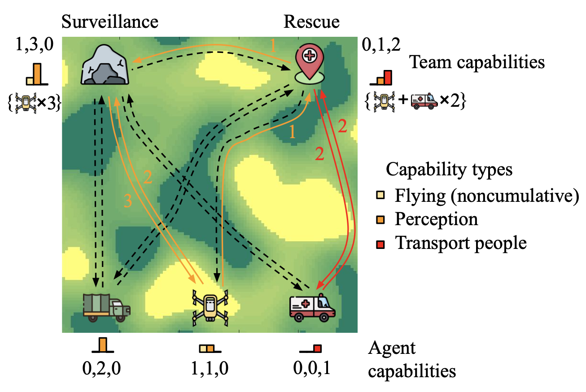

# Resilient Team Planner

This repository implements a stochastic programming framework [1]-[2] for multi-agent systems where task decomposition, assignment, and scheduling problems are simultaneously optimized. The framework can be applied to heterogeneous mobile robot teams with distributed sub-tasks. Examples include pandemic robotic service coordination, explore and rescue, and delivery systems with heterogeneous vehicles.



To generate the problem description files that can be run by this repository, also check this repository: [`resilient_teaming_example`](https://gitlab.com/barton-research-group/open/resilient_teaming_example).


## Install dependencies
### yaml-cpp
Download and install yaml-cpp from https://github.com/jbeder/yaml-cpp.

### Gurobi
Download and install the Gurobi optimizer from https://www.gurobi.com/downloads.

Obtain and add a suitable license following the instructions on the website.

## Build
Set the environmental variables GUROBI_DIR and GUROBI_HOME in FindGUROBI.cmake (the first two lines) to the main directory of the installed GUROBI package.

Set the GUROBI_LIBRARY NAMES to your gurobi version (removing the last digit).

As an example, the default ones are
```bash
set(GUROBI_DIR /Library/gurobi1000/macos_universal2/)
set(GUROBI_HOME /Library/gurobi1000/macos_universal2/)
find_library(GUROBI_LIBRARY
    NAMES gurobi100     # This should be your gurobi version (removing the last digit)
    HINTS ${GUROBI_DIR} $ENV{GUROBI_HOME}
    PATH_SUFFIXES lib)
```

Then, run the following from the main directory to build the executives.
```bash
mkdir build
cd build
cmake ..
make
```

## Run an example case

To run an example test case, enter the following command when in the directory `build/`.
```bash
./main ../config/mission0/planner_param.yaml ./result.yaml
# ./main <planner_param.yaml> <result.yaml>
```

The executive file ./main takes the first input as a param file and output the planning result to a result file.

The illustrative example in `config/mission0/` involve three agent types, three tasks, and two types of capabilities. The contents of the parameter files are described in the table below and more details are added as comments in the parameter files.

<table>
<thead>
<tr>
<th align="center">File name</th>
<th align="center">Contents</th>
</tr>
</thead>
<tbody>
<tr>
<td align="left">planner_param.yaml</td>
<td align="left">The planner parameters.</td>
</tr>
<tr>
<td align="left">task_param.yaml</td>
<td align="left">Task requirements.</td>
</tr>
<tr>
<td align="left">vehicle_param.yaml</td>
<td align="left">Agent's energy limits and capabilities.</td>
</tr>
<tr>
<td align="left">graph.yaml</td>
<td align="left">The planner parametersThe graph describing the edge cost and the connectivity between the locations of the agents and tasks.</td>
</tr>
</tbody></table>

## Planner modes (different optimization models)
There are five planner modes that can be run on the example problems.

Change the `flagSolver: TEAMPLANNER_DET` in `planner_param.yaml` to see other results.

| Planner Modes             | Descriptions  |
| ------------------------- |:-------------:|
|TEAMPLANNER_DET            | No uncertainty is considered. The deterministic method in [1]. Also the method 'CTAS-O' in [2].                       |
|TEAMPLANNER_SPR            | The uncertainty in the traveling energy cost is considered. The method is constrained optimization with resource [1]. |
|TEAMPLANNER_CCP            | The uncertainty in the traveling energy cost is considered. The method is chance constrained programming [1].         |
|TEAMPLANNER_CONDET         | No uncertainty is considered. Runs faster than TEAMPLANNER_DET (using a relaxation). The method 'CTAS-D' in [2].      |
|TEAMPLANNER_CONTASKLSHAPED | The uncertainty in task requirements and agent capabilities are considered. The method 'CTAS' in [2].                 |

The following command will run different modes on the example problems (run the command in the directory `build/`).

`config/energy/`: An offroad multi-agent mission \[[1](https://arxiv.org/pdf/2010.11376.pdf)\] containing 14 tasks, 6 agent species, and 8 types of capabilities.

`config/medical/`: A robotic service during a pandemic \[[2](https://arxiv.org/pdf/2106.12111.pdf)\] containing 16 tasks, 7 agent species, and 9 types of capabilities.

```bash
# Run the case in config/energy/
./main ../config/energy_int/planner_param.yaml ./energy_int_result.yaml # TEAMPLANNER_DET
# Before executing the next line, change the flagSolver: TEAMPLANNER_DET to TEAMPLANNER_CCP in config/energy_int/planner_param.yaml
./main ../config/energy_int/planner_param.yaml ./energy_int_result_ccp.yaml # TEAMPLANNER_DET
# Before executing the next line, change the flagSolver: TEAMPLANNER_DET to TEAMPLANNER_SPR in config/energy_int/planner_param.yaml
./main ../config/energy_int/planner_param.yaml ./energy_int_result_spr.yaml # TEAMPLANNER_DET
# Run the case in config/medical/
./main ../config/medical_int/planner_param.yaml ./medical_int_result.yaml # TEAMPLANNER_DET
./main ../config/medical_con/planner_param.yaml ./medical_con_result.yaml # TEAMPLANNER_CONDET
# Before executing the next line, change the flagSolver: TEAMPLANNER_CONDET to TEAMPLANNER_CONTASKLSHAPED in config/medical_con/planner_param.yaml
./main ../config/medical_con/planner_param.yaml ./medical_con_result_risk.yaml # TEAMPLANNER_CONTASKLSHAPED
```

## Python Binding
There is a Python binding for the C++ programs in this repository. See `src/main.py` for example usages.

To run the example. First navigate to the `src/` directory. Then run the following command.
```bash
python3 main.py
```

## References

[1] B. Fu, W. Smith, D. Rizzo, M. Castanier, and K. Barton, “Heterogeneous vehicle routing and teaming with Gaussian distributed energy uncertainty,” in 2020 IEEE/RSJ International Conference on Intelligent Robots and Systems (IROS). IEEE, 2020, pp. 4315-4322 \[[PDF](https://arxiv.org/pdf/2010.11376.pdf)\]

[2] B. Fu, W. Smith, D. Rizzo, M. Castanier, M. Ghaffari, and K. Barton, “Robust task scheduling for heterogeneous robot teams under capability uncertainty,” arXiv preprint arXiv:2106.12111, 2021. \[[PDF](https://arxiv.org/pdf/2106.12111.pdf)\] \[[Video](https://youtu.be/gQR1CQV5z_0)\]
